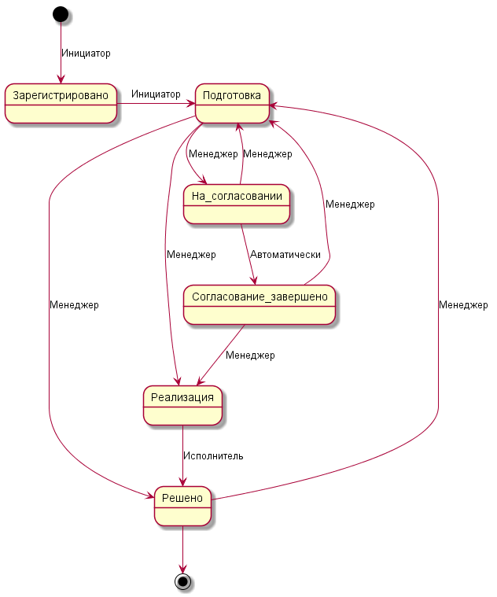

Раздел "Изменения"
==================

Атрибутный состав
-----------------

|№ п/п| Поле | Тип | Описание |
|:--|:--|---|:--|
| 1|id| целое | Уникальный идентификатор |
| 2|no| целое | Номер изменения |
| 3|subject| строка | Тема |
| 4|description| строка | Описание |
| 5|status| EntityStatus | Статус изменения: |
| 6||||
| 7||||
| 8||||
| 9||||
|10||||
`todo` дописать описание полей

Жизненный цикл
--------------

### Статусы
1. Зарегистрировано
1. Подготовка
1. На согласовании
1. Согласование завершено
1. Реализация
1. Решено
1. Закрыто

### Сценарий

Пользователь, имеющий право на создание изменения, заводит в системе новое изменение.
Новое изменение получает статус `Зарегистрировано`. Сам пользователь становится
<b>Инициатором</b> изменения. В статусе `Зарегистрировано` он может редактировать
параметры изменения, в том числе назначает <b>Менеджера изменений</b>. По завершению
правки <b>Инициатор</b> переводит изменение в статус `Подготовка`.

В статусе `Подготовка` <b>Менеджер изменений</b> выполняет анализ изменения,
выставляет категорию, приоритет и прочее. При необходимости может попросить
<b>Инициатора</b> внести коррективы в параметры изменения. Создать наряд
для уточнения оценки трудозатрат. Назначается <b>Исполнитель</b>. Если изменение
является стандартным, то <b>Менеджер изменений</b> переводит изменение в статус
`Реализация`. Иначе он определяет список <b>Согласующих</b> и устанавливает
критерий принятия решения. Затем переводит изменение в статус `На согласовании`.
Также <b>Менеджер изменений</b> может отклонить изменение и перевести в статус `Закрыто`.

В статусе `На согласовании` запрещена правка параметров изменения. Из данного статуса
можно перейти в статус `Подготовка`, если <b>Менеджер изменений</b> отменит
согласование. Также из данного статуса может осуществиться автоматический переход в статус
`Согласование завершено` при выполнении критериев согласования. Для этого
<b>Согласующие</b> выставляют свое решение.

В статусе `Согласование завершено` при положительном исходе процедуры
согласования <b>Менеджер изменений</b> переводит изменение в статус `Реализация`.
В случае отрицательного исхода <b>Менеджер изменений</b> переводит изменение в
статус `Подготовка`

<b>Исполнитель</b>, при необходимости, может создать дополнительные наряды для
выполнения работ, указанных в описании изменения. Он следит за выполнением нарядов.
По завершении работ <b>Исполнитель</b> переводит изменение в статус `Решено`.

В статусе `Решено` <b>Менеджер изменений</b> проверяет достигнутые результаты.
В случае успеха переводит в статус `Закрыто`, иначе в статус `Подготовка`.

P.S. обязательным условием возможности менять статус изменения является
право доступа на редактирование сущности "Изменение".

### Схема

